本次任务选用paddlepaddle完成cifar10图像分类。

本次任务选用paddlepaddle完成cifar10图像分类。
1. 安装paddlepaddle：https://www.paddlepaddle.org.cn/install/quick?docurl=/documentation/docs/zh/develop/install/pip/windows-pip.html#cpu
2. 使用官网提供的baseline跑一下实验结果
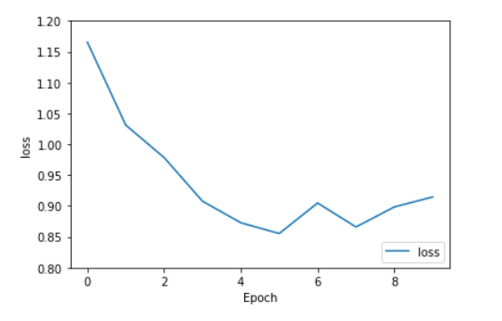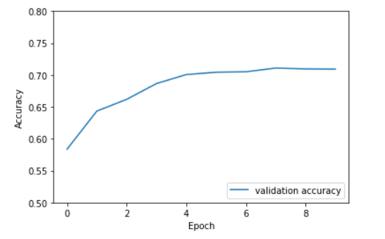
可以看到loss在前几个epoch快速下降，accuracy不断提升并最终稳定在0.70附近。
3. 观察修改输入输出通道对模型效果的影响
输入输出通道前后对比：
之前：
`self.conv1 = paddle.nn.Conv2D(in_channels=3, out_channels=32, kernel_size=(3, 3))
self.conv2 = paddle.nn.Conv2D(in_channels=32, out_channels=64, kernel_size=(3,3))
self.conv3 = paddle.nn.Conv2D(in_channels=64, out_channels=64, kernel_size=(3,3))`
之后：
`self.conv1 = paddle.nn.Conv2D(in_channels=3, out_channels=12, kernel_size=(3, 3))
self.conv2 = paddle.nn.Conv2D(in_channels=12, out_channels=24, kernel_size=(3,3))
self.conv3 = paddle.nn.Conv2D(in_channels=24, out_channels=64, kernel_size=(3,3))`

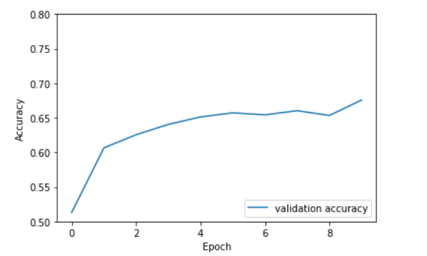
发现loss高于原模型，同时accuracy也比原模型要低
再尝试一次：
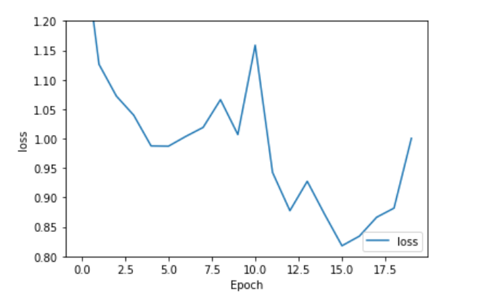
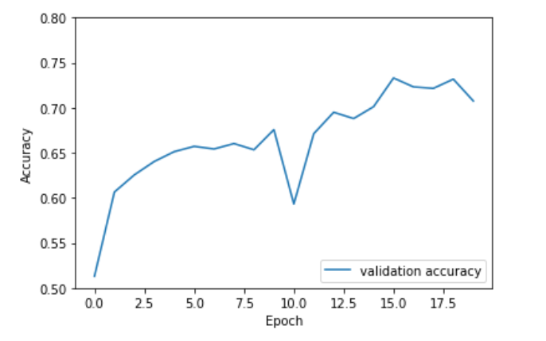
发现loss变化波动较大，accuracy虽然中间达到过0.7317，但是后面又降低了下来，可能是出现了过拟合的情况。
中间很好奇对性能的要求,发现占用了50%的CPU资源以及6GB的内存
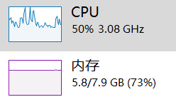
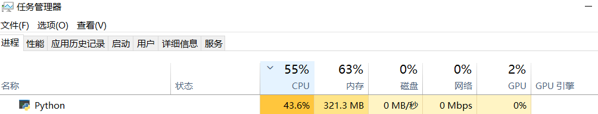
4. 将batch_size从32调整为64

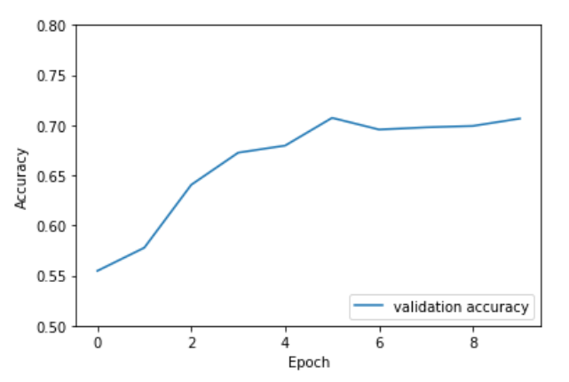
发现与原模型相比没有很大的提升
5. 将learning_rate调整从0.001调整为0.004

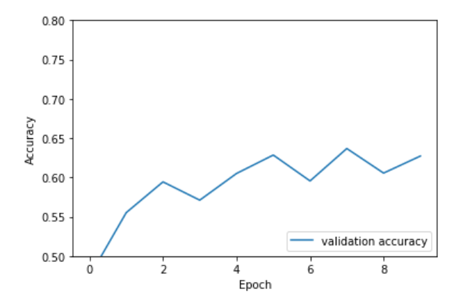
发现准确率低了很多
尝试调整为0.002
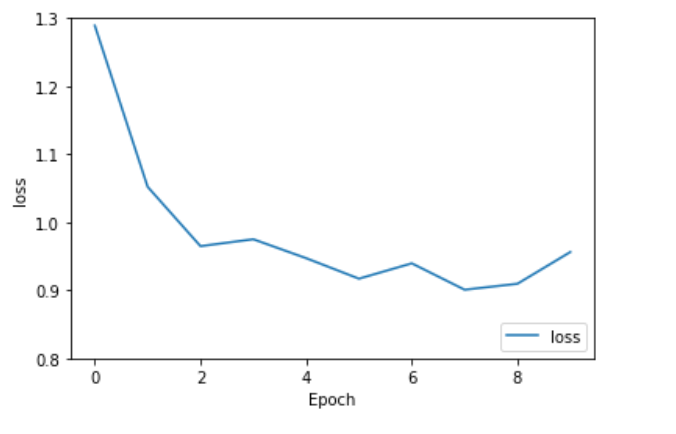
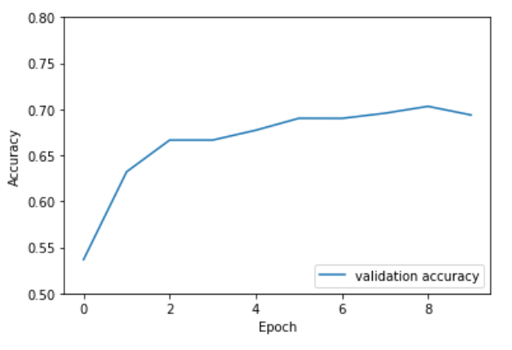
与原模型效果没有什么差别
尝试调整为0.00001，为了观察效果，增加了epoch_num
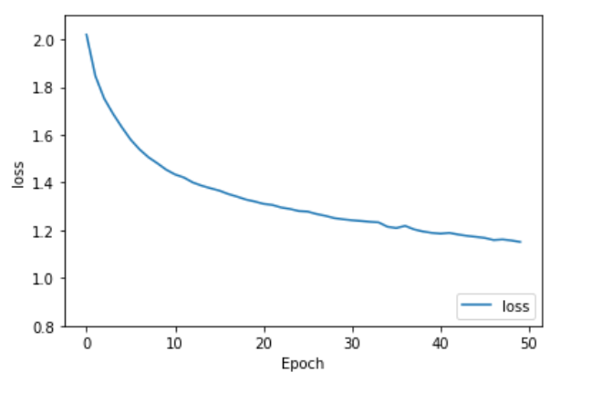

发现准确率稳步上升，但是到后面的轮次的时候上升趋势放缓，因此放弃了通过增加轮次来提升accuracy值使其突破0.75。
6. 将batch_size调整为2

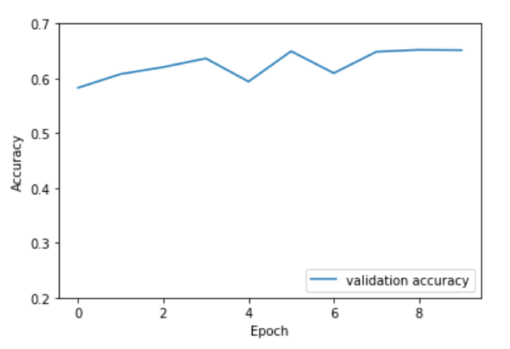
发现一开始就达到了较理想的情况，后面变化不大。